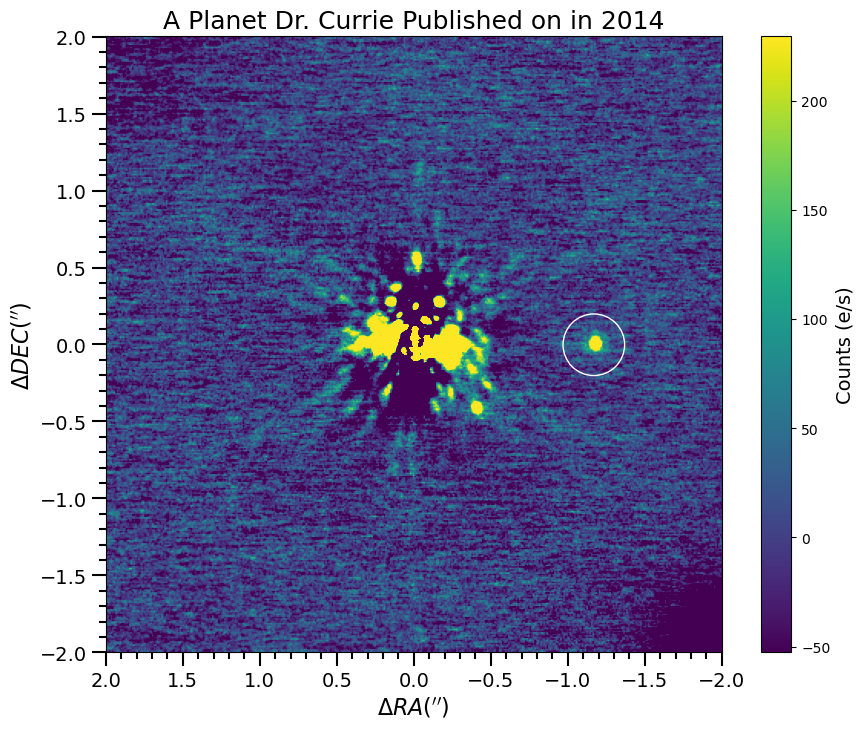

### Problem 1 Feedback (8 pts)

* Rate your knowledge of Python syntax prior to starting this course (1 = no knowledge, 10 = highly proficient)
* Rate your knowledge of Python syntax at the end of this course (1 = no knowledge, 10 = highly proficient) 

* Rate your knowledge of core Python packages (NumPy, SciPy, Matplotlib) prior to starting this course (1 = no knowledge, 10 = highly proficient)
* Rate your knowledge of core Python packages (NumPy, SciPy, Matplotlib) at the end of this course (1 = no knowledge, 10 = highly proficient) 

* Rate your knowledge of astronomy-specific Python packages (AstroPy, AstroQuery,Photutils) at the start of this course (1 = no knowledge, 10 = highly proficient)
* Rate your knowledge of astronomy-specific Python packages (AstroPy, AstroQuery,Photutils) at the end of this course
 
* Which topics you would have like to have covered in this class that were not covered?
* Which, if any, topics do you feel were excessively covered?

### Problem 2 Astrometry and Photometry with Photutils (2 pts; + 3 possible extra credit point)

The file "star_nopsfsub.fits" is an unsaturated image of the star (which should be in the middle of the image).  The file "psfsub.fits" is the same image with the stellar halo removed to flatten the background and reveal a planet-mass companion nearly due-west of the star (it's at an x position of about 320).

Assume that the pixel scale is roughly 9.952 milliarcseconds/pixel and that the image is rotated perfectly north-up, east-left.

* read in this file using astropy functions

* using photutils, compute the centroid of the planet-mass companion's position in pixel values (x and y).   Then, given the pixel scale, compute its position in arc-seconds in units [East, North] _relative_ to the star. 

    (again, the image is north-up, east-left: so objects east of the star will have a negative x value and vice versa. If its position were 0.5 arcseconds east and -0.7 arcseconds south of the star then you would report this as [East, North] = [0.5,-0.7]).
    
    
* using photutils, plot the radial-profile of the star.  Find where the star's brightness roughly (emphasis on **roughly**!) decreases to about half its peak value: round up to the nearest integer and set this value to be the aperture radius.

* Compute photometry of the star (from "nopsfsub" and the companion (from "psfsub") with this aperture radius both in units of counts.  Then compute the contrast between the star and the planet in units of magnitudes (note: do not overthink this: it's as simple as it sounds).

**Extra Credit** (3 points)

- Display the image as shown below
  (2 points)

 
- What is the name of this planet? (1 point)

 

Hints: 

* to figure out a good initial guess for the centroid positions, try doing the extra credit part by displaying the image using Matplotlib: the notes give a good recipe for how to do this.

* look at the notes on photutils VERY closely to figure out how to plot the radial profile.   The answer for the half-peak value will be in between two integers: again, round up to get the aperture radius you should use.
* you do not need to compute astrometric errors or photometric errors