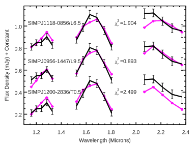

# _Python for Scientific Data Analysis_

## Homework - Week 8 (due October 18)


### 1. Curve Fitting

* start with ``inputdata.txt`` located in the week 8 homework folder

* read in these data with ``np.loadtxt``

* visualize the data using a very simple matplotlib call:
 
  i.e.
  
  ```
  import matplotlib.pyplot as plt
  
  
  plt.scatter([variable name for x],[variable name for y])
  
  ```
  
  What kind of function does this look like? (note: the answer is functionally simple and involves two coefficients and one variable)
  
  
* Fit the data with ``curve_fit``.   To do this, define a simple function whose form is based on your answer to the previous item.  Report the values for the two coefficients needed to fit the data.

* Compare your solution by plotting the data (as in item 3) with the functional fit overplotted (don't worry about nice-looking formatting: just the data + function are good enough)

* Why might the fit not look perfect?


### 2. Basic Statistics with SciPy and NumPy

The file ``diskmasses.txt`` now found in the problem set directory for this section contains estimates for the masses (er, log(disk mass)) of protoplanetary disks for a large number of stars in the Taurus-Aurigae star-forming region.   

* Read in this file using ``np.loadtxt``.  
* Compute the mean, median, and _sample_ variance of the log(disk mass) with NumPy .   
* Compute the 25th and 75th percentile for log(disk mass).


### 3. Binomial and Poisson Statistics: Confidence Intervals

Evaluate this statement [note: the numbers are made up]:

"In our study of the Blanco 1 open cluster from the Spitzer Space Telescope, we detect debris disks around 5 A stars out of a sample of 25.   Thus, the disk fraction around A stars in Blanco 1 is 20% $\pm$ 9.8%.   

At the 68.2% confidence limit (1-$\sigma$ for a normal distribution), this disk fraction is slightly lower than 30% found in the sum-total of other open clusters of comparable ages".

### 4. Goodness-of-Fit, $\chi_{}^{2}$


Consider ...

 * a model with two free parameters fit to 115 data points, yielding a $\chi^{2}$ statistic of 127.
 * a model with one free parameter fit to 15 data points with a  $\chi^{2}$ statistic of 26.

 
 - Compute the $p$ values for both model fits.
 - Which models are consistent with the data at the 1-$\sigma$ confidence limit?  At 3-$\sigma$?

### 5. Goodness-of-Fit, $\chi_{\nu}^{2}$

See the attached figure panel comparing the spectrum of a brown dwarf to a library of other substellar objects.   Assume that each model fit loses one degree of freedom (so $\nu$ = 1). 

- Compute the $\chi^{2}$ values for the three model fits.
- Compute the $p$ values for the three model fits.  




### 6. Student's t-distribution

Use the ``def tpenalty`` function as a starting point ...

* Assume that you are computing a contrast curve with an instrument that uses only half of the field of view. 

* What is the contrast penalty at a distance of 2.5 $\lambda$/D from the star?


